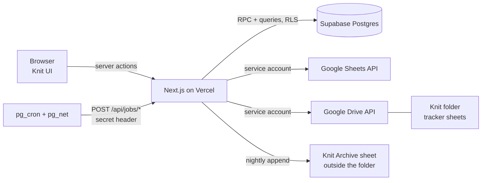

# Knit: Product Requirements Document (full stack)

| | |
| --- | --- |
| Product | Knit |
| Owner | Pragaman Kumar Anurag (pragaman@noboruworld.com) |
| Version | 1.0, 25 Sep 2026 |
| Builder | Claude Code, following `CLAUDE.md` |
| Companion docs | `docs/SOW.md` (scope, phases, acceptance), `docs/TRACKERS.md` (the four example trackers) |

This document is the single source of truth for what Knit does and how it is built. If code and this document disagree, this document wins until it is changed. Section 5 lists every product decision; change a decision there before changing code.

---

## 1. Summary

Knit is a web app that gathers tasks from several Google Sheet trackers into one daily list. It shows what is due today across every tracker, lets the user change a task's status in one place, and writes that status back to the source sheet. When the day closes at midnight India time, anything unfinished is locked as Not Done on that day and reappears on the next working day as a spillover, until it is closed. Past days are read-only. Future tasks can be pulled forward and completed early.

The source trackers stay the place where work is planned. Knit is the place where the day is executed and accounted for: nothing due can vanish silently.

---

## 2. Glossary

| Term | Meaning |
| --- | --- |
| Tracker | One tab of one Google Sheet, registered in Knit. A spreadsheet with two task tabs is two trackers |
| Knit folder | The one Google Drive folder Knit reads. Only native Google Sheets inside it can become trackers |
| Registry | The saved configuration of a tracker: which headers mean date, title, status, owner, and so on |
| Task | One data row of a tracker. Its id is the Knit ID written into the sheet |
| Knit ID | A UUID that Knit writes into a hidden column of every tracker row. The only way Knit identifies a row |
| Knit Note | A visible column Knit writes in every tracker, summarising the task's state in Knit ("Spilled 2x · now due Mon 5 Oct") |
| Planned date | The date written in the source tracker. Knit never changes it |
| Due date | The date the task is expected in Knit, derived from the planned date and the off-day policy |
| Task-day | A task's appearance on one date. A task missed twice and done on the third day has three task-days |
| Spillover | A task-day created on the next working day because the previous one closed unfinished |
| Day lock / close | The midnight process that makes a day read-only and creates spillovers |
| Working day | Monday to Friday and the 1st and 3rd Saturday of the month, minus holidays |
| IST | Asia/Kolkata. The only timezone Knit uses for any date decision |

---

## 3. Goals, non-goals, success metrics

### 3.1 Goals
1. One screen answers "what must I finish today?" across all trackers, showing the source tracker on every task.
2. Two-way status sync between Knit and each tracker.
3. Missed work never disappears: it locks as Not Done and spills to the next working day until closed.
4. New trackers plug in by configuration only, even with completely different columns.
5. Same stack and login model as the Noboru Learning Tracker, ready to extend to teammates.
6. Robust: when unsure, Knit stops and says why. It never guesses and never deletes source data.

### 3.2 Non-goals (v1)
- Creating or planning tasks in Knit. Tasks are born in trackers.
- Editing a task's title, planned date, or other content in Knit.
- Time blocks or scheduling within a day.
- Email, WhatsApp or push notifications.
- Offline mode.
- Replacing any tracker's layout, formulas or workflow.

### 3.3 Success metrics
| Metric | Target |
| --- | --- |
| Due tasks that end a day with no status | 0 |
| Hub vs sheet mismatches in the nightly check | 0 on 10 consecutive working days (Phase 1 exit) |
| Status change reaching the sheet | p95 under 60 s |
| Sheet change reaching Knit | under 10 min, or immediately with Sync now |
| Adding a tracker | under 10 min, no code |
| Today screen load | under 1.5 s on office broadband |

---

## 4. Users, roles, stages

| Role | Can |
| --- | --- |
| Admin (Pragaman) | Everything a member can, plus: connect and configure trackers, manage users and people aliases, holidays, see Sync health and Needs Attention, view any user's day, make audited corrections to locked days |
| Member (Stage 3+) | See and update only tasks assigned to them; report an issue on a locked day |

| Stage | Who uses Knit | Ownership model |
| --- | --- | --- |
| 1 (Phases 1-2) | Pragaman only | Tasks assigned by the owner column, matched to his aliases |
| 2 (Phase 3) | Teammates added | Each tracker still has one primary owner; owner column routes rows |
| 3 (Phase 4) | Several people per tracker | Owner column routes each row to one or more users; conflict rules tighten |

---

## 5. Decisions log

Status: **Adopted** = settled. **Default** = adopted as the default because the owner has not confirmed yet; build it exactly as written, and make it a config value where noted so it can change without code.

| # | Decision | Rule | Status |
| --- | --- | --- | --- |
| D1 | Old rows when a tracker connects | Each tracker has a go-live date. Rows planned before it are history only. A one-time backlog review lets the admin bring open old rows forward, mark them done, or cancel them | Default |
| D2 | Reasons | Blocked and Cancelled require a one-line reason (max 140 chars) | Default |
| D3 | Pulled forward | Future tasks set to In Progress appear in Today under Pulled forward, and never spill before their due date | Default |
| D4 | Evening heads-up | After 17:30 IST, an in-app banner lists how many of today's tasks are still open. No notifications | Default |
| D5 | Devices | Desktop-first, fully usable on phones, installable to home screen (web manifest, no offline), session kept 30 days | Default |
| D6 | Accounts | Admin creates every login (email + password). No self sign-up. Password change is optional | Adopted |
| D7 | Knit Note | A visible Knit Note column at the far right of every tracker, kept current by Knit | Adopted |
| D8 | Task drawer | Clicking a task opens a read-only side drawer with all details and full history | Default |
| D9 | Content edits | Title, planned date and all content are edited only in the sheet. The drawer links to the exact row | Default |
| D10 | Day close | Midnight IST (00:00). A task finished at 23:50 counts for that day | Adopted |
| D11 | Working days | Mon to Fri plus 1st and 3rd Saturday; holidays from the Holidays list | Adopted |
| D12 | Planned date in source | Never changed by Knit. Spillover is shown through the Knit Note | Adopted |
| D13 | Early completion | Planned date kept; a separate Completed On date is recorded | Adopted |
| D14 | Single source boundary | Only sheets inside the Knit folder are synced | Adopted |
| D15 | Hosting | Supabase, GitHub and Vercel all under pragaman@noboruworld.com | Adopted |
| N1 | Tasks planned on an off day | `offDayPolicy` per tracker. Default `previous_working_day` (a Sunday post is due on the last working day before it). Other values: `next_working_day`, `keep` | Default |
| N2 | 5th Saturdays | Off. Only the 1st and 3rd Saturdays are working days (affects 31 Oct 2026 and 30 Jan 2027) | Adopted |
| N3 | Rows owned by others | `ownerFilter: "mine"`: only rows whose owner cell contains one of the user's aliases are assigned to them. Other rows are synced and visible in All Tasks with the Everyone toggle, but never on Today | Default |
| N4 | Date ranges and open dates | "1-6 Oct" is a window: shown under Ongoing from its first working day, due on its last, spills after. "From 30 Oct" is open-ended: shown under Ongoing from that date, never spills | Default |
| N5 | Noboru "Moved" | Treated as Cancelled with reason "Moved in source". No spill | Default, confirm |
| N6 | Formula columns | Knit never writes to a column whose data cells contain formulas. Such columns can be read, not mapped as a write target | Adopted |
| N7 | Row identity | Knit always adds its own Knit ID column, even where a tracker has its own ID (G01, REEL-01). The tracker's ID is kept as `sourceRef` for display | Adopted |
| N8 | Statuses a tracker cannot express | If `writeBack[status]` is null, Knit leaves the status cell unchanged and shows the status only in the Knit Note | Adopted |
| N9 | Open-ended tasks and statuses | Setting Done or Cancelled on an open-ended task creates its completion task-day on today (6.5). Yet to Start, In Progress and Blocked stay on the task only, so it never spills (N4). A completion task-day changed back the same day locks at close as it is, never as Not Done | Default |
| N10 | Changes before a day is closed | Between midnight and the day's close, a task whose open task-day is still on the previous day cannot be changed: `set_task_status` refuses with `day_not_closed` until the close runs (it retries every 15 minutes, 10.5) | Default |
| N11 | Rows removed at source | A task removed at source cannot be changed in Knit (`task_removed_at_source`): there is no row to write back to | Default |
| N12 | Close order | `close_day(D)` refuses while an earlier day still has open task-days (`close_day_out_of_order`), so days always close in date order (6.4 step 3) | Default |
| N13 | Blocked spillovers | The spillover of a Blocked task-day keeps its reason (D2) | Default |
| N14 | Correction details | "Closed by correction on {date}" uses the date the correction is made. Correcting to Done sets Completed On to the corrected task-day's date. A correction always needs a reason (one line, max 140 chars) | Default |
| N15 | Corrections to a non-final status | They change that task-day's history only. If the task would be left with no open task-day, the correction is refused (`correction_would_orphan_task`); open-ended tasks instead reopen with the new status. How a finished dated task should reopen is Q6 | Default |
| N16 | Local development without Google | `KNIT_SHEET_SOURCE=local` makes the example trackers in `fixtures/trackers` the Knit folder, with writes saved in `.knit-local/`; the Google variables are then optional. Refused on Vercel production, where `google` (the default) is the only mode | Default |

---

## 6. Domain rules

These rules are the heart of the product. Each has unit tests (section 17).

### 6.1 Knit statuses

| Key | Label | Set by | Spills? | Counts as a miss? |
| --- | --- | --- | --- | --- |
| `yet_to_start` | Yet to Start | user, or source | yes | yes |
| `in_progress` | In Progress | user, or source | yes, carrying In Progress | yes |
| `blocked` | Blocked | user (reason required), or source | yes, carrying Blocked | no |
| `done` | Done | user, or source | no | no |
| `cancelled` | Cancelled | user (reason required), or source | no | no |
| `not_done` | Not Done | system only, at day close | creates the spillover | yes |

A user can pick any of the first five. `not_done` is never user-selectable and only exists on locked task-days.

### 6.2 Working-day calendar

`is_working_day(d)` is true when all hold:
- `d` is not a Sunday
- if `d` is a Saturday, it is the 1st or 3rd Saturday of its month (`ceil(day_of_month / 7)` is 1 or 3)
- `d` is not in `holidays`

Holidays (loaded from `fixtures/holidays.json` by a migration, so every environment, production included, has them):

| Date | Day | Holiday |
| --- | --- | --- |
| 2026-04-14 | Tue | Ambedkar Jayanti |
| 2026-05-01 | Fri | Labour Day |
| 2026-08-15 | Sat | Independence Day |
| 2026-09-14 | Mon | Ganesh Chaturthi |
| 2026-10-02 | Fri | Gandhi Jayanti |
| 2026-10-20 | Tue | Dussehra |
| 2026-11-08 | Sun | Diwali |
| 2027-01-01 | Fri | New Year (Hangover Day) |
| 2027-01-26 | Tue | Republic Day |
| 2027-03-22 | Mon | Holi |

`calendar_days` is materialised for 2026-01-01 to 2027-12-31 by `refresh_calendar()`, first by that same migration, and refreshed whenever holidays change. `next_working_day(d)` and `prev_working_day(d)` read it. The calendar must be extended before it runs out; Sync health warns 60 days ahead.

### 6.3 Dates

#### 6.3.1 Date kinds
| Kind | Example | Fields |
| --- | --- | --- |
| `single` | real date cell, "Mon 28 Sep", "28/09/2026" | `planned_start` |
| `window` | "1-6 Oct", "28 Sep to 2 Oct" | `planned_start`, `planned_end` |
| `open` | "From 30 Oct", "30 Oct onwards" | `planned_start` |
| `invalid` | "TBD", "Sat 28 Sep" (weekday mismatch) | none; raises Needs Attention |
| `empty` | blank cell | row skipped unless it already exists as a task (then Needs Attention) |

#### 6.3.2 Parser
Implemented as a pure function `parsePlannedDate(cell, today)` in `lib/domain/dates.ts`. The input carries both the cell's effective value and its formatted string.

1. A real date cell (Sheets serial number) is a `single` date. Convert serial to date without timezone arithmetic.
2. Otherwise normalise the string: trim, lowercase, collapse whitespace, normalise en dash and similar dashes to `-`.
3. Recognise, in order: open-ended (`from X`, `X onwards`), window (`X - Y`, `X to Y`, `D-D Mon`), single.
4. Single date forms: `dd/mm/yyyy`, `dd/mm/yy`, `dd-mm-yyyy`, `yyyy-mm-dd`, `[weekday] d Mon [yyyy]`, `Mon d [yyyy]`, `d Month [yyyy]`. Numeric forms are always day-first.
5. Year inference when the year is missing:
   - weekday present: choose the year among `today.year - 1`, `today.year`, `today.year + 1` whose date falls on that weekday; if several, the one closest to today; if none, `invalid: weekday_mismatch`.
   - no weekday: choose the year that places the date within 183 days of today.
6. Window: both ends parsed with the same rules; the end month applies to a start without one ("1-6 Oct"). End before start is `invalid: range_end_before_start`.
7. Impossible dates ("31 Sep") are `invalid: not_a_date`.

All cases in `fixtures/date-parser.cases.json` must pass (reference today 2026-09-25).

#### 6.3.3 Due date (off-day policy)
`due_date` is computed from the planned date and the tracker's `offDayPolicy`:

| Kind | `due_date` |
| --- | --- |
| single | planned date if working; else `prev_working_day` (default), `next_working_day`, or the date itself (`keep`) |
| window | last day of the window, adjusted the same way |
| open | null |

Examples from the real trackers under the default policy: Noboru row planned Fri 2 Oct (Gandhi Jayanti) is due Thu 1 Oct. Sapiens post planned Sun 25 Oct is due Fri 23 Oct, because Sat 24 Oct is a 4th Saturday. Sapiens post planned Sun 8 Nov (Diwali) is due Sat 7 Nov, a 1st Saturday.

Ongoing visibility: a window task appears under Ongoing on every working day from `max(planned_start, first working day)` until done or until its due date, when it appears in Due today. An open task appears under Ongoing from its start date until done.

### 6.4 Task-days, spillover and day close

1. Every task with a `due_date` on or after the tracker's go-live date has exactly one task-day on its due date (`spill_index = 0`) while that date is today or later.
2. Day close for day D (runs at or after 00:00 IST of D+1):
   - Task-days on D with status `done` or `cancelled`: lock as they are.
   - Task-days on D with `yet_to_start` or `in_progress`: set `carried_status` to the current status, set status `not_done`, lock.
   - Task-days on D with `blocked`: keep `blocked`, set `carried_status = blocked`, lock.
   - For every task-day locked as `not_done` or `blocked`: insert a task-day on `next_working_day(D)` with status = `carried_status`, `spill_index + 1`, origin `spillover`. The insert is `on conflict (task_id, day) do nothing`.
   - Any task-day on any date whose status became `done` or `cancelled` on D (`status_changed_on = D`) is also locked. This freezes early completions.
3. Closing runs for every unclosed day in order, so an outage of several days is caught up correctly. Off days are closed too (usually with nothing to do).
4. A locked task-day is never modified except through an admin correction (6.10).

Worked example (Filing Buddy task G21, planned Wed 30 Sep, `in_progress` when the day ends):

| Day | Result |
| --- | --- |
| Wed 30 Sep | Locked `not_done` (carried In Progress). Spillover created on Thu 1 Oct, spill 1 |
| Thu 1 Oct | Not finished. Locked `not_done`. Next working day skips Fri 2 Oct (Gandhi Jayanti): spillover on Sat 3 Oct (1st Saturday), spill 2 |
| Sat 3 Oct | Not finished. Locked `not_done`. Sun 4 Oct is off: spillover on Mon 5 Oct, spill 3 |
| Mon 5 Oct | Done at 19:10. Task-day `done`, locked at close. Knit Note: "Done on 5 Oct · after 3 spills" |

### 6.5 Pulled forward and early completion
- Any task-day dated after today can be set to any user status.
- A future task set to `in_progress` shows under Pulled forward on Today. It does not spill before its due date. On its due date it moves into Due today.
- A future task set to `done`: `completed_on = today`, its future task-day becomes `done` with `status_changed_on = today`. Today lists it in Done today tagged "early". Its own date shows "Done early, 24 Sep".
- A status set today can be changed again until today closes. After that it is locked.
- An open-ended task has no task-day until it is completed; completing it creates a task-day on today with status `done`.

### 6.6 Changes made in the source
| Change in sheet | Knit behaviour |
| --- | --- |
| Status changed | Applied to the task's current open task-day (today's, else its future one) through the merge rules in 10.3 |
| Marked done in the sheet | Current open task-day becomes `done`; `completed_on` = the tracker's completed-on value if mapped and not in the future, else today |
| Planned date moved, task open, new due date today or later | The open task-day moves to the new due date |
| Planned date moved into the past, task open | The open task-day moves to today as a spillover; Needs Attention item `past_date_added` |
| New row with a due date already past (after go-live) | Created with a task-day on today as spillover (`spill_index = 1`); Needs Attention `past_date_added` |
| Row deleted | `removed_at_source` set. Open task-days become `cancelled`, reason "Removed at source". Locked history untouched |
| Row content edited (title, details) | Updated in Knit; no status effect |
| Date cell becomes invalid | Task keeps its last good dates; Needs Attention `bad_date` |

### 6.7 Owners and people
- `people_aliases` maps a normalised name (trimmed, lowercased) to a user, or to "known non-user" (e.g. Shlok before Stage 3, Sales, Creative, Agent).
- The owner cell is split by the tracker's `ownerSeparators` (Filing Buddy uses `,` and `+`, so "P + Agent" is ["P", "Agent"]).
- Each part that matches a user alias assigns the task to that user. Known non-users are ignored silently. An unknown name raises one Needs Attention item per distinct name per tracker, never per row.
- `ownerFilter: "mine"` (default): tasks with no matching user are synced but unassigned; they appear only in All Tasks with the Everyone toggle (admin only in Stage 1).
- If a tracker has no owner column, every task is assigned to the tracker's `owner_user_id`.

### 6.8 Status mapping and write-back
- `statusMap`: normalised source word to Knit status. Blank is a valid key.
- Unmapped word: the task is treated as `yet_to_start`, never `done`, and one Needs Attention item is raised per distinct word per tracker.
- `writeBack`: Knit status to the exact word written to the `statusWrite` column. `null` means do not touch the cell (N8). `""` means clear the cell.
- `cancelReasons`: optional reason text for source words that map to `cancelled` (Noboru: "moved" gives "Moved in source").
- The wizard reads the status column's data-validation list (Sheets API `dataValidation`) so every allowed word is mapped at setup, not only the words present today.
- Formula columns (N6): at setup and on every structure check, Knit inspects the column's data cells. If any data cell holds a formula, the column is marked read-only and cannot be `statusWrite` or `completedOn`. Noboru's `Status` column is a formula; its writable status is the `Done` column.
- `completedOnFormat`: `{type: "date"}` writes a real date (USER_ENTERED `yyyy-mm-dd`); `{type: "text", pattern}` writes text in that pattern (Filing Buddy uses "EEE d MMM", e.g. "Mon 28 Sep"); `null` means not written.

### 6.9 Knit Note text
Rendered by the pure function `renderKnitNote(task, taskDays, today)`, max 80 characters, dates as `EEE d MMM`. It is the only implementation of these rules: the push job calls it when it builds the cell writes (10.4), from the task's state at that moment. SQL never renders the note.

| State | Note |
| --- | --- |
| Open, never spilled | empty, or "In progress" / "Blocked: {reason}" |
| Open, spilled | "Spilled {n}x · now due {date}" (+ " · In progress" / " · Blocked: {reason}") |
| Done on time | "Done on {date}" |
| Done after spills | "Done on {date} · after {n} spills" |
| Done early | "Done early on {date} · planned {due}" |
| Cancelled | "Cancelled: {reason}" |
| History only (before go-live) | "Before Knit go-live" |

### 6.10 Corrections (admin only)
- Allowed on any locked task-day. The admin picks the new status and must give a reason.
- The change is recorded as an `events` row with origin `correction`, old and new values, and reason. The task-day's status changes; its history stays visible in the drawer.
- Correcting a task-day to `done` or `cancelled` closes the chain: every later task-day of that task is set `cancelled` with reason "Closed by correction on {date}", including locked ones, inside the same audited transaction. The task's `status` and `completed_on` update, and a write-back is queued.

### 6.11 Go-live and backlog review (D1)
- On activation, rows with `due_date < go_live_date` are stored with `history_only = true` and no task-day.
- The backlog review screen lists history-only rows whose source status is not done or cancelled. Bulk actions: Bring to today (creates a task-day on today, spill_index 1, clears `history_only`), Mark done, Cancel (reason required). Rows left untouched stay history only.

---

## 7. Architecture

### 7.1 Stack
- Next.js (current stable, App Router), TypeScript strict, Tailwind CSS, shadcn/ui components, React Server Components with server actions for mutations.
- Supabase: Postgres, Auth (email + password), Row Level Security, `pg_cron`, `pg_net`, Vault.
- Vercel for hosting the app and the job endpoints.
- Google Sheets API v4 and Google Drive API v3 through a Google Cloud service account.
- Libraries: `@supabase/ssr`, `@supabase/supabase-js`, `googleapis` (or `google-auth-library` + `fetch`), `zod`, `date-fns` + `date-fns-tz`, `xlsx` (SheetJS, test fixtures only), `vitest`, `@playwright/test`.
- Supabase project region: Mumbai (`ap-south-1`).

### 7.2 Components


- UI mutations call Postgres RPC functions. All business rules that protect data (locks, reasons, permissions, outbox) are enforced inside those functions, so no client path can bypass them.
- Job endpoints run the sync engine. Each invocation does bounded work and exits; state lives in the database.
- The service account key and Supabase service-role key exist only in server environment variables.

### 7.3 Jobs and schedules
All schedules are `pg_cron` entries calling `net.http_post` to the app with the header `x-knit-cron-secret`. `pg_cron` runs in UTC.

| Job | Endpoint | Schedule (UTC) | Work per call |
| --- | --- | --- | --- |
| Discover + pull | `POST /api/jobs/pull` | `*/10 * * * *` | List the Knit folder, then pull each active tracker whose Drive `modifiedTime` changed, until the time budget is used |
| Push | `POST /api/jobs/push` | `* * * * *` | Process due outbox items, grouped by tracker |
| Close days | `POST /api/jobs/close` | `*/15 * * * *` | Close every unclosed day before today (IST), oldest first; no-op otherwise |
| Structure check | `POST /api/jobs/structure` | `0 1 * * *` (06:30 IST) | Re-verify headers, formula columns, Knit columns on every tracker |

- Each job takes a lease in `job_leases` (`acquire_lease(job, ttl_seconds)`); a second overlapping call exits immediately.
- Each call has a time budget of 80% of the function's configured `maxDuration` (set `maxDuration` to the plan's allowed maximum). Unfinished work continues on the next call.
- A status change in the UI also triggers an immediate best-effort push for that item (server action, 5 s timeout), so most writes land within seconds; the cron push is the retry path.
- `Sync now` on Today calls the pull endpoint for the user's trackers with the user's session (admin: all trackers), rate-limited to once per 30 s per user.

### 7.4 Google integration
- One Google Cloud project with the Sheets API and Drive API enabled, and one service account. Its JSON key is stored base64-encoded in `GOOGLE_SERVICE_ACCOUNT_JSON`.
- The Knit folder is shared with the service account email as Editor. Every sheet inside inherits access.
- Scopes: `https://www.googleapis.com/auth/spreadsheets` and `https://www.googleapis.com/auth/drive.readonly`.
- Drive calls: `files.list` with `q = "'<folderId>' in parents and trashed = false"`, fields `id, name, mimeType, modifiedTime`. Only `mimeType = application/vnd.google-apps.spreadsheet` can become a tracker. Anything else (for example an uploaded `.xlsx`) is shown as "Not a Google Sheet: open it and use File > Save as Google Sheets".
- Sheets calls:
  - Setup and structure check: `spreadsheets.get` with a field mask for `sheets.properties` (title, sheetId, gridProperties) and grid data for the header row plus a sample of data rows including `userEnteredValue` (formula detection) and `dataValidation` (status options).
  - Pull: `spreadsheets.values.batchGet` for the used range, once with `valueRenderOption=UNFORMATTED_VALUE, dateTimeRenderOption=SERIAL_NUMBER` and once with `FORMATTED_VALUE`, so dates are exact and text is as displayed.
  - Push: read the Knit ID column, map ids to rows, then one `spreadsheets.values.batchUpdate` per tracker with `valueInputOption=USER_ENTERED`, then re-read the written cells to verify.
  - Setup writes: `spreadsheets.batchUpdate` to append the Knit ID and Knit Note columns if needed, hide the Knit ID column, and add a warning-only protected range over it ("Managed by Knit").
- Tabs are identified by `sheetId` (gid), never by name, so renaming a tab does not break anything; the new name is picked up on the next pull.
- Requests are batched per tracker. Retries use exponential backoff with jitter on 429 and 5xx. Check the current Sheets API per-minute quotas and stay well below them.

### 7.5 SheetSource abstraction
All sheet access goes through one interface so the engine is testable without Google:

```ts
interface SheetSource {
  listFolder(): Promise<DriveFile[]>;
  getFileModifiedTime(fileId: string): Promise<string>;
  listTabs(fileId: string): Promise<TabInfo[]>;                       // title, sheetId
  readStructure(ref: TabRef, headerRow: number): Promise<TabStructure>; // headers, formula columns, validation options per column
  readRows(ref: TabRef, headerRow: number): Promise<SheetRow[]>;        // rowNumber + per-header {value, formatted}
  readColumn(ref: TabRef, header: string): Promise<Array<{row: number; value: string}>>;
  ensureKnitColumns(ref: TabRef): Promise<{knitIdHeader: string; knitNoteHeader: string}>;
  writeCells(ref: TabRef, cells: CellWrite[]): Promise<void>;          // by row + header
}
```
Implementations: `GoogleSheetSource` (production), `XlsxFixtureSource` (reads `fixtures/trackers/*.xlsx`, read-only), `MemorySheetSource` (tests for writes, row moves and races).

---

## 8. Data model

All tables live in schema `public` with RLS enabled. Timestamps are `timestamptz`; calendar dates are `date` computed in IST.

### 8.1 DDL (target shape; write it as ordered migrations)
```sql
create type knit_status as enum ('yet_to_start','in_progress','blocked','done','cancelled','not_done');
create type date_kind as enum ('single','window','open');
create type tracker_state as enum ('draft','active','paused','disconnected','archived');
create type drive_file_state as enum ('new','ignored','connected','not_a_sheet','left_folder');
create type outbox_state as enum ('pending','held','done','failed','superseded');
create type change_origin as enum ('hub','source','system','correction');

create table app_users (
  id uuid primary key references auth.users(id) on delete cascade,
  name text not null,
  email text not null unique,
  role text not null check (role in ('admin','member')),
  is_active boolean not null default true,
  created_at timestamptz not null default now()
);

create table people_aliases (
  alias_norm text primary key,               -- lower(trim(alias)), whitespace collapsed
  display text not null,
  user_id uuid references app_users(id),     -- null = known non-user
  created_at timestamptz not null default now()
);

create table holidays (day date primary key, name text not null);
create table calendar_days (day date primary key, is_working boolean not null, reason text);
create table settings (key text primary key, value jsonb not null);  -- knit_folder_id, archive_sheet_id, go_live defaults

create table drive_files (
  file_id text primary key,
  name text not null,
  mime_type text not null,
  modified_time timestamptz,
  state drive_file_state not null default 'new',
  first_seen_at timestamptz not null default now(),
  last_seen_at timestamptz not null default now()
);

create table trackers (
  id uuid primary key default gen_random_uuid(),
  file_id text not null references drive_files(file_id),
  sheet_gid bigint not null,
  tab_name text not null,
  name text not null,
  color text not null,
  owner_user_id uuid references app_users(id),
  state tracker_state not null default 'draft',
  pause_reason text,
  config jsonb not null,                      -- validated by the zod schema in 8.2
  go_live_date date not null,
  state_version bigint not null default 0,    -- bumped on every hub-side status change
  last_pull_at timestamptz,
  last_source_modified_time timestamptz,
  created_at timestamptz not null default now(),
  unique (file_id, sheet_gid)
);

create table tasks (
  id uuid primary key,                        -- = Knit ID in the sheet
  tracker_id uuid not null references trackers(id),
  source_ref text,
  row_hint int,
  title text not null,
  subtitle text,
  details jsonb not null default '{}',
  planned_raw text,
  date_kind date_kind,
  planned_start date,
  planned_end date,
  due_date date,
  critical boolean not null default false,
  owner_raw text,
  status knit_status not null default 'yet_to_start',
  status_reason text,
  source_status_raw text,
  completed_on date,
  history_only boolean not null default false,
  removed_at_source timestamptz,
  source_snapshot jsonb,                      -- last values read from or written to mapped columns
  hub_changed_at timestamptz,
  source_synced_at timestamptz,
  created_at timestamptz not null default now(),
  updated_at timestamptz not null default now()
);
create index on tasks (tracker_id);
create index on tasks (due_date);

create table task_assignees (
  task_id uuid references tasks(id) on delete cascade,
  user_id uuid references app_users(id),
  primary key (task_id, user_id)
);

create table task_days (
  id bigserial primary key,
  task_id uuid not null references tasks(id),
  day date not null,
  status knit_status not null,
  carried_status knit_status,
  spill_index int not null default 0,
  origin text not null check (origin in ('planned','spillover','backlog','completion')),
  reason text,
  status_changed_on date,
  locked boolean not null default false,
  locked_at timestamptz,
  unique (task_id, day)
);
create index on task_days (day);

create table outbox (
  id bigserial primary key,
  task_id uuid not null references tasks(id),
  tracker_id uuid not null references trackers(id),
  payload jsonb not null,                     -- {status_value|null, completed_on|null}; Knit Note rendered at push time (6.9)
  state outbox_state not null default 'pending',
  attempts int not null default 0,
  next_attempt_at timestamptz not null default now(),
  last_error text,
  created_at timestamptz not null default now(),
  done_at timestamptz
);
create index on outbox (state, next_attempt_at);

create table events (
  id bigserial primary key,
  task_id uuid references tasks(id),
  task_day_id bigint references task_days(id),
  tracker_id uuid references trackers(id),
  actor_user_id uuid references app_users(id),   -- null for system and source
  origin change_origin not null,
  field text not null,
  old_value text,
  new_value text,
  reason text,
  at timestamptz not null default now()
);

create table sync_runs (
  id bigserial primary key,
  job text not null,
  tracker_id uuid references trackers(id),
  started_at timestamptz not null default now(),
  finished_at timestamptz,
  ok boolean,
  stats jsonb,
  error text
);

create table day_closures (
  day date primary key,
  state text not null check (state in ('running','closed','failed')),
  started_at timestamptz not null default now(),
  closed_at timestamptz,
  stats jsonb,
  error text
);

create table attention_items (
  id bigserial primary key,
  tracker_id uuid references trackers(id),
  task_id uuid references tasks(id),
  kind text not null,       -- unmapped_status, bad_date, duplicate_knit_id, unknown_owner, conflict,
                            -- missing_header, missing_knit_id_column, write_blocked, past_date_added,
                            -- row_not_found, formula_column, member_report, calendar_ending
  dedupe_key text not null, -- e.g. 'unmapped_status:copy ready'
  detail jsonb not null default '{}',
  state text not null default 'open' check (state in ('open','resolved','dismissed')),
  created_at timestamptz not null default now(),
  resolved_at timestamptz
);
create unique index on attention_items (tracker_id, dedupe_key) where state = 'open';

create table job_leases (job text primary key, holder uuid not null, expires_at timestamptz not null);
```

### 8.2 Tracker config schema (`trackers.config`, validated with zod)
```ts
const TrackerConfig = z.object({
  headerRow: z.number().int().min(1),
  columns: z.object({
    date: z.string(), title: z.string(),
    statusRead: z.string(), statusWrite: z.string().nullable(),
    completedOn: z.string().nullable(), owner: z.string().nullable(), sourceRef: z.string().nullable(),
    critical: z.object({ header: z.string(), truthy: z.array(z.string()) }).nullable(),
  }),
  readOnlyColumns: z.array(z.string()),          // detected formula columns, also set manually
  titleTemplate: z.string(),                     // "{Asset ID} · {Working title}"
  subtitleTemplate: z.string().nullable(),
  detailColumns: z.array(z.string()),
  ownerSeparators: z.array(z.string()).default([","]),
  ownerFilter: z.enum(["mine", "all"]).default("mine"),
  offDayPolicy: z.enum(["previous_working_day", "next_working_day", "keep"]).default("previous_working_day"),
  statusMap: z.record(z.string(), KnitUserStatus),         // keys normalised; "" allowed
  cancelReasons: z.record(z.string(), z.string()).default({}),
  writeBack: z.record(KnitUserStatus, z.string().nullable()),
  completedOnFormat: z.union([z.object({ type: z.literal("date") }),
                              z.object({ type: z.literal("text"), pattern: z.string() }), z.null()]),
});
```
Templates reference headers in braces; missing values render as empty and the separator collapses. `fixtures/trackers.config.json` holds real configs for all four example trackers.

---

## 9. Database functions and security rules

### 9.1 RPC functions
All are `security definer`, set `search_path = public`, and check the caller themselves.

| Function | Caller | Does |
| --- | --- | --- |
| `knit_today()` | any | `(now() at time zone 'Asia/Kolkata')::date` |
| `is_working_day(d)`, `next_working_day(d)`, `prev_working_day(d)` | any | From `calendar_days` |
| `refresh_calendar(from, to)` | admin | Rebuild `calendar_days` from the rules and `holidays` |
| `set_task_status(task_id, status, reason)` | assigned user or admin | Validates: status is user-selectable; reason present for blocked/cancelled; target task-day not locked; the task is not removed at source (N11) and is not waiting for an earlier day's close (N10). Picks the target task-day (today's; else the task's future one; for open tasks set to done or cancelled, creates a `completion` task-day on today, N9). Setting the same status and reason again changes nothing. Updates task and task-day, sets `status_changed_on = knit_today()`, `hub_changed_at = now()`, bumps `trackers.state_version`, writes an `events` row, supersedes older pending outbox rows for the task, inserts a new outbox row with the write-back payload (the status word from `writeBack`, or null per N8, and `completed_on`). The Knit Note is rendered by the push job (6.9), not here. Returns the updated task view |
| `admin_correct_task_day(task_day_id, status, reason)` | admin | Section 6.10 with N14 and N15, one transaction |
| `apply_pull_plan(tracker_id, expected_state_version, plan jsonb, run_id)` | service role | Applies a pull plan atomically. If `state_version` changed since the plan was computed, applies nothing and returns `retry` |
| `close_day(d)` | service role | Section 6.4 with N9 and N13, one transaction, idempotent. Refuses if `d >= knit_today()`, or while an earlier day has open task-days (N12). Returns counts and the ids of the tasks it touched, for the close job's Knit Note refresh (10.5) |
| `acquire_lease(job, ttl)`, `release_lease(job, holder)` | service role | Job mutual exclusion |
| `backlog_action(task_ids, action, reason)` | admin | Section 6.11 |

### 9.2 Row Level Security
- `app_users`: a user reads their own row; admin reads all. Writes only through admin server actions using the service role.
- `tasks`, `task_days`, `events`: select allowed when the caller is admin, or the task has a `task_assignees` row for the caller. No insert, update or delete for `authenticated`; changes only through RPC.
- `task_assignees`: select allowed when the caller is admin, or the row's `user_id` is the caller. No insert, update or delete for `authenticated`; rows change only through RPC and the pull job.
- `trackers`: members can select trackers that have at least one task assigned to them (name and colour only, through a view `tracker_public`). Admin full select. Writes through admin server actions.
- `outbox`, `sync_runs`, `day_closures`, `attention_items`, `job_leases`, `drive_files`, `settings`, `people_aliases`: admin select only (members can insert `attention_items` of kind `member_report` through an RPC). `people_aliases` is written through admin server actions.
- `holidays`, `calendar_days`: all authenticated users select; admin writes.

### 9.3 Other security rules
- Public sign-up disabled in Supabase Auth. Users are created by admin through the Auth Admin API from a server action.
- Job endpoints reject any request without the correct `x-knit-cron-secret` (constant-time comparison) and are excluded from auth middleware.
- The service-role key is used only in job endpoints and admin server actions, never in code that can reach the browser.
- All server action inputs are validated with zod.
- Security headers via Next.js config (no framing, strict referrer policy).

---

## 10. Sync engine

### 10.1 Discover
1. `listFolder()`. Upsert `drive_files` with name, mime type, modified time, `last_seen_at`.
2. New native Google Sheet: state `new`, shown in Admin > Trackers under "New sheet found".
3. Non-sheet file: state `not_a_sheet`.
4. A file that was seen before and is no longer listed: state `left_folder`; every tracker on it becomes `paused` with reason "Left the Knit folder". Its data stays. If it comes back, the admin presses Resume.

### 10.2 Pull (per active tracker)
1. Skip if the file's `modifiedTime` equals `last_source_modified_time` and the call is not forced.
2. Structure check: read the header row. Every mapped header must be found (normalised match). If not: tracker `paused`, reason names the missing header, attention `missing_header`, stop. Knit ID column missing: `paused`, attention `missing_knit_id_column`, stop (it is recreated only after the admin confirms).
3. `readRows()`. Ignore rows that are empty in every mapped column.
4. Row identity:
   - Rows with a Knit ID: match to tasks.
   - The same Knit ID on two rows: the lower row is treated as new (gets a new ID) and attention `duplicate_knit_id`.
   - Rows without a Knit ID: generate UUIDs, write them to the sheet first (one batch), then re-read the Knit ID and title columns and confirm each new ID sits beside the title it was generated for. Any mismatch (someone inserted a row in between): clear those IDs and leave the rows for the next pull. Only confirmed rows proceed.
5. For each row, build a `NormalisedRow`: parsed date and due date (6.3), mapped status (6.8), owners (6.7), title, subtitle, details, critical, sourceRef, completedOn, and the raw snapshot of every mapped column.
6. Compute the pull plan with the pure function `planPull(dbState, rows, today, config)`. The plan lists task inserts and updates, assignee changes, task-day inserts and moves, removals, outbox re-enqueues, attention items and events. Rules: 6.3 to 6.8 and the merge table in 10.3. Locked task-days are never in a plan.
7. `apply_pull_plan(...)`. On `retry`, reload state and recompute (max 3 times, then log and move on).
8. Update `last_pull_at`, `last_source_modified_time`, write a `sync_runs` row with counts.

### 10.3 Three-way merge (status and completed-on)
"Source changed" = the source value differs from `source_snapshot`. "Hub changed" = `hub_changed_at > source_synced_at`, or the task has a pending outbox row.

| Source changed | Hub changed | Result |
| --- | --- | --- |
| no | no | nothing |
| yes | no | apply source value to the task and its open task-day; event origin `source` |
| no | yes | keep hub value; make sure a pending outbox row exists |
| yes | yes | hub wins in Stages 1 and 2; attention `conflict` with both values; outbox re-enqueued. Stage 3 revisits this rule |

Content fields (title, subtitle, details, dates, owner, critical, sourceRef) always come from the source.

After a successful push, `source_snapshot` is updated to exactly what was written, so Knit's own write is never mistaken for a source change.

### 10.4 Push
1. Take due outbox rows (`pending`, `next_attempt_at <= now()`), newest per task wins, older ones become `superseded`. Group by tracker. Rows for paused trackers become `held`, and return to `pending` on resume.
2. Per tracker: `readColumn(Knit ID)` to map ids to row numbers at write time. Missing id: row fails with attention `row_not_found`.
3. Guard: never write to a column in `readOnlyColumns` or one detected as a formula column. A violation fails the row with attention `formula_column`.
4. Build cell writes: status cell (skip if `writeBack` value is null), completed-on cell (if mapped: value on done, cleared on revert), Knit Note cell (rendered now by `renderKnitNote` from the task's current state, 6.9). One `batchUpdate`.
5. Re-read the written cells. On match: outbox `done`, update `source_snapshot` and `source_synced_at`. On mismatch or error: `attempts + 1`, `next_attempt_at` by backoff 1 min, 2 min, 5 min, 15 min, 60 min; after 5 attempts state `failed`, attention `write_blocked`, and the task shows an amber "Not saved to sheet" pill until it succeeds or the admin retries.

### 10.5 Close days
1. Take the lease. Find the oldest unclosed day before `knit_today()` (from the earliest tracker go-live date).
2. For that day D: set `day_closures(D) = running`; run a forced pull of all active trackers; run push until the outbox has no due rows for active trackers (bounded by the time budget); call `close_day(D)`; enqueue Knit Note updates for every task whose task-days changed; append D's rows to the Knit Archive sheet; run the mismatch check; mark D `closed`.
3. Failure at any step: `day_closures(D) = failed` with the error; the next call retries from the start. Every step is idempotent.
4. If yesterday is still not closed at 08:00 IST, admin sees a red banner on Today.

### 10.6 Mismatch check
For every active tracker, compare each task's Knit status mapped through `writeBack` with the sheet's current status cell (skip statuses whose write-back is null). Differences become attention `conflict` items with both values and are counted in the day's closure stats. The Phase 1 exit criterion reads this count.

### 10.7 Knit Archive sheet
A Google Sheet outside the Knit folder, shared with the service account, id in `settings.archive_sheet_id`. Tabs `task_days` and `events`. Close-days appends the rows for day D after deleting any rows already present for D, so re-runs never duplicate.

---

## 11. Tracker setup wizard (Admin > Trackers)

| Step | Screen | Rules |
| --- | --- | --- |
| 1 | New sheet found list | Only native Google Sheets in the Knit folder. Actions: Set up, Ignore |
| 2 | Pick tab | Tabs listed by title; stored by `sheetId`. A tab already connected is shown as such |
| 3 | Header row | First 10 rows shown; the first mostly-text row is suggested; admin confirms |
| 4 | Map columns | Dropdowns of headers for Date, Title (or a title template), Status read, Status write, Completed on, Owner, Source ID, Critical flag (+ truthy values), up to 8 detail columns. Formula columns are labelled "formula, read-only" and disabled as write targets. Sample values from 5 rows beside each choice. The date column shows a parse rate; under 90% shows a warning listing failing values |
| 5 | Map statuses | Every value from the status column's dropdown rule plus every distinct value found, each with a count and a Knit status dropdown. Then a write-back value per Knit status, chosen from the dropdown options, or "leave unchanged", or "clear". Activation is blocked while any value is unmapped |
| 6 | Owners and policies | Owner separators, owner filter, off-day policy. Unknown owner names found in the tab are listed with: link to a user, mark as non-user |
| 7 | Name, colour, go-live | Colour from an 8-colour palette; go-live defaults to today |
| 8 | Preview | First 20 tasks as Today would show them, plus counts: tasks, mine, by date kind, off-day moves, invalid dates, unmapped statuses. Nothing is written yet |
| 9 | Activate | Adds Knit ID and Knit Note columns at the first empty columns after the last used header (appending grid columns if needed), hides Knit ID, adds a warning-only protection over it, writes IDs, runs the first pull |
| 10 | Backlog review | Section 6.11 |

Editing a live tracker's mapping later: the same screens; saving runs a structure check and a forced pull. Changing a mapping never rewrites history.

---

## 12. Screens

### 12.1 Routes
| Route | Screen | Access |
| --- | --- | --- |
| `/login` | Email + password | public |
| `/` | Today | signed in |
| `/day/[yyyy-mm-dd]` | Day view (same layout as Today) | signed in |
| `/calendar` | Month calendar with the selected day's table below | signed in |
| `/tasks` | All Tasks list | signed in |
| `/admin/trackers` | Trackers, New sheet found, wizard | admin |
| `/admin/trackers/[id]` | Tracker settings, Resume, Pause, Sync now | admin |
| `/admin/sync` | Sync health: per tracker last pull, last push, failures, closures | admin |
| `/admin/attention` | Needs Attention queue | admin |
| `/admin/people` | Users and people aliases | admin |
| `/admin/holidays` | Holidays; refresh calendar | admin |
| Task drawer | `?task=<id>` on any list route | per RLS |

### 12.2 Layout and style
- Top bar: Knit wordmark, date, links (Today, Calendar, All Tasks, Admin), Sync now, user menu.
- Tracker chips: one colour each from the palette `indigo, teal, amber, rose, violet, emerald, sky, orange`, always with the tracker name as text.
- Status never relies on colour alone: every status has an icon and a label.
- Neutral theme (white surfaces, near-black text, one accent). Light and dark follow the system. The palette can later be swapped for Noboru brand colours through CSS variables.
- Under 640 px wide, table rows become stacked cards with the status control full width.
- Keyboard: every control reachable; status dropdown operable with arrows and Enter; visible focus rings.

### 12.3 Today
Header line: "Thu 24 Sep · 4 of 9 done · 2 spilled in". Denominator = task-days on today assigned to the user, excluding cancelled; numerator = those done.

Groups, in this order (empty groups hidden):
1. **Spillover**: today's task-days with `spill_index > 0`, not done, not blocked. Red badge "Spilled {n}x · from {original due date}".
2. **Due today**: today's task-days with `spill_index = 0`, not done, not blocked.
3. **Ongoing**: window and open tasks active today (6.3.3).
4. **Pulled forward**: tasks due after today with status `in_progress`.
5. **Blocked**: today's task-days with status blocked, greyed, reason shown.
6. **Done today**: today's task-days done or cancelled, plus tasks completed early today (tag "early"). Collapsed by default.

Row columns: critical marker, Title (and subtitle), Tracker chip, Due date (and planned date if different, e.g. "Due Fri 23 Oct · planned Sun 25 Oct"), Status control, Spill count, Open in sheet (link to the exact row: `https://docs.google.com/spreadsheets/d/{fileId}/edit#gid={gid}&range=A{row}`).

Sorting inside groups: critical first, then due date, then tracker name, then title.

Status control: dropdown of the five user statuses. Blocked and Cancelled open a reason input; Cancelled also asks for confirmation ("This removes it from all future days"). After a change: optimistic update, a small pill "Syncing" that clears when the outbox row is done (poll every 3 s while any row is pending), turns amber "Not saved to sheet" after failure.

Filters: tracker (multi), status.

Banners (top of Today, in priority order): yesterday not closed (admin); a tracker paused ("Sapiens paused: column 'Status' not found. Showing data from 10:40."); evening heads-up after 17:30 IST when open tasks remain ("3 tasks are still open. At midnight they move to Mon 5 Oct.").

### 12.4 Day view and Calendar
- Calendar: month grid, Monday first. Each date cell shows a colour state and a small count:
  - Green: every task-day that day is done or cancelled (past days)
  - Red: a locked day with at least one `not_done`
  - Amber: today or future with open work
  - Grey hatched: off day, with the reason on hover ("Sunday", "2nd Saturday", "Dussehra")
  - Blank: working day with nothing
- Selecting a date shows that day's table below. Past days show a lock icon and disabled controls. Future days are editable (pulling forward).
- Previous and next arrows move by day in the day view and by month in the calendar.

### 12.5 All Tasks
Every task one per row with date filters (range), tracker, status, owner (admin: Everyone toggle), and search on title. Columns: Title, Tracker, Planned, Due, Status, Spill count, Completed on. Pagination 50 per page. Used for looking up and for pulling forward.

### 12.6 Task drawer
Title, subtitle, tracker chip, source ID, planned raw text and parsed dates, due date, owner raw text, critical flag, detail columns as label/value pairs (long text collapsible), Open in sheet link, then a timeline of task-days (date, status, spill index, reason, locked) and events (who, what, from where, when). Admin sees Request correction on locked task-days; members see Report an issue.

### 12.7 Empty and edge states
| Situation | Copy | Offers |
| --- | --- | --- |
| Working day, nothing due | "Nothing is planned for today." | Next 3 upcoming tasks with Pull forward buttons |
| All done | "All clear for today. {n} tasks done." | Tomorrow's tasks, collapsed |
| Off day selected | "Day off ({reason}). Nothing is due or spills here." | Jump to next working day |
| Past day, nothing scheduled | "Nothing was scheduled on this day." | none |
| Tracker cannot sync | Banner as in 12.3 | Admin: Fix link to tracker settings |
| New member, no tasks | "No trackers are connected to your account yet." | Contact admin |
| Admin, no trackers yet | "Connect your first tracker." | Link to Admin > Trackers |

### 12.8 Admin screens
- Trackers: list with state, last pull, task count, open attention count; New sheet found section; Set up, Pause, Resume, Sync now, Edit mapping, Archive.
- Sync health: last 50 `sync_runs`, outbox counts by state with Retry failed, `day_closures` for the last 14 days, calendar coverage end date.
- Needs Attention: grouped by tracker and kind; each item shows what happened, where (row link), and actions (map status, link owner, dismiss, retry).
- People: users (create, deactivate, reset password) and aliases (add, link to user, mark non-user).
- Holidays: list, add, remove; saving calls `refresh_calendar`. Warns if a change affects task-days already created (their due dates are recomputed for unlocked task-days only).

---

## 13. Server actions and endpoints

| Name | Type | Input | Notes |
| --- | --- | --- | --- |
| `signIn`, `signOut` | action | email, password | Supabase Auth |
| `setTaskStatus` | action | taskId, status, reason? | Calls RPC, then best-effort immediate push |
| `pullForward` | action | taskId, status | Same RPC on a future task-day |
| `syncNow` | action | none | Rate limited 1 per 30 s per user |
| `reportIssue` | action | taskDayId, text | Member attention item |
| `correctTaskDay` | action (admin) | taskDayId, status, reason | RPC |
| `trackerWizard*` | actions (admin) | per step | Uses SheetSource; saves draft config |
| `activateTracker`, `pauseTracker`, `resumeTracker` | actions (admin) | trackerId | |
| `backlogAction` | action (admin) | taskIds, action, reason? | RPC |
| `createUser`, `deactivateUser`, `upsertAlias` | actions (admin) | | service role |
| `upsertHoliday`, `deleteHoliday` | actions (admin) | | then `refresh_calendar` |
| `/api/jobs/pull` | POST | `{force?: boolean, trackerIds?: string[]}` | cron secret |
| `/api/jobs/push` | POST | none | cron secret |
| `/api/jobs/close` | POST | none | cron secret |
| `/api/jobs/structure` | POST | none | cron secret |
| `/api/health` | GET | none | returns ok, db reachable, last closure day; no secrets |

---

## 14. Failure handling

| Failure | Behaviour |
| --- | --- |
| Mapped header renamed or deleted | Tracker paused, attention `missing_header`, tasks stay visible with "as of" time, outbox rows held |
| Columns moved | No effect (headers matched by name) |
| Rows sorted, inserted, moved | No effect (rows found by Knit ID at write time) |
| Knit ID duplicated by copy-paste | Lower row gets a new ID; attention `duplicate_knit_id` |
| Knit ID column deleted | Tracker paused; recreate only after admin confirms, matching rows by source ID or title + planned date, with a preview |
| Tab renamed | No effect (gid) |
| Sheet moved out of the folder | Tracker paused "Left the Knit folder" |
| Non-sheet file in folder | Listed as not a Google Sheet, never synced |
| Invalid date | Row skipped (new) or keeps last good dates (existing); attention `bad_date` |
| Unmapped status | Treated as Yet to Start; attention `unmapped_status` |
| Unknown owner | One attention item per name per tracker |
| Write to protected range refused | Outbox retries then `failed`; attention `write_blocked` |
| Google 429 or 5xx | Backoff with jitter; outbox waits |
| Job overlap | Lease prevents it |
| Close-days interrupted | Idempotent retry every 15 min; catch-up in date order |
| Supabase unavailable | UI error page with retry; Knit Archive sheet holds history up to the last closed day |
| Clock or timezone mistakes | All date logic through `knit_today()` and `lib/time.ts`; tests run with frozen time and a non-IST process timezone |

---

## 15. Non-functional requirements
- Performance: Today query under 300 ms server time for 1,000 tasks; pull of a 1,000-row tracker under 20 s.
- Reliability: every job idempotent; no data loss when any job is killed mid-run.
- Auditability: every status change has an `events` row with actor and origin.
- Accessibility: WCAG 2.1 AA contrast; labels on all controls; status conveyed by icon and text.
- Privacy: tracker content stays in Supabase and the Archive sheet; no third-party analytics.
- Maintainability: domain logic in pure, tested modules; SQL in migrations; no business rules in React components.

---

## 16. Project structure
```
app/
  (auth)/login/
  (app)/page.tsx                 Today
  (app)/day/[date]/
  (app)/calendar/
  (app)/tasks/
  (app)/admin/{trackers,sync,attention,people,holidays}/
  api/jobs/{pull,push,close,structure}/route.ts
  api/health/route.ts
components/                      UI only, no business rules
lib/
  domain/                        pure: dates.ts, calendar.ts, status.ts, owners.ts, note.ts, templates.ts, planPull.ts
  sheets/                        SheetSource + GoogleSheetSource, XlsxFixtureSource, MemorySheetSource
  sync/                          discover.ts, pull.ts, push.ts, close.ts, structure.ts, leases.ts
  supabase/                      server, browser, service clients
  time.ts                        IST helpers (single place that knows the timezone)
  env.ts                         zod-validated environment
supabase/
  migrations/                    ordered SQL, including the holiday list and the first calendar build
  seed.sql                       local development data only: settings, admin alias rows
tests/
  unit/                          domain + planner
  integration/                   RPCs against local Supabase
  e2e/                           Playwright flows
fixtures/                        from this spec pack
docs/                            this PRD, SOW, TRACKERS, RUNBOOK (written during build)
```

---

## 17. Testing
- **Unit (Vitest)**: date parser against `fixtures/date-parser.cases.json`; working-day calendar (every date in Oct 2026 checked by hand-written expectations, including 2 Oct, 3 Oct, 10 Oct, 20 Oct, 31 Oct); due-date policy with the off-day examples in `fixtures/trackers.config.json`; status mapping incl. unmapped and blank; owner splitting ("P + Agent", "Anjan, Shlok, Pragaman"); Knit Note rendering for every row of 6.9; templates; `planPull` merge table (all four rows) and every row of 6.6.
- **Fixture tests**: run the whole read path (XlsxFixtureSource + config + planner) over each example tracker and assert the `expected` block in `fixtures/trackers.config.json` (row counts, my rows, date kinds, off-day moves, formula columns detected, no unmapped statuses except the documented pending ones).
- **Integration (local Supabase via CLI)**: `set_task_status` permission and lock rules; `close_day` creates spillovers, skips holidays and off Saturdays, is idempotent when run twice; catch-up over a 3-day gap; `admin_correct_task_day` closes the chain; `apply_pull_plan` returns retry on stale `state_version`; RLS: a member cannot read another member's tasks.
- **Race tests (MemorySheetSource)**: row inserted between ID write and verify; rows sorted between read and push; duplicate Knit IDs; push after a column move.
- **E2E (Playwright)**: log in, see Today, change a status, see Syncing clear; pull forward from Calendar; locked past day is read-only; empty states render.
- Time is always injected; tests run with `TZ=UTC` to prove IST handling does not depend on the machine. In SQL, integration tests freeze `knit_today()` per transaction through its test clock (`set_config('knit.today', ...)`), which the Data API cannot set.
- The integration tests also run on PGlite (Postgres in-process, with a stand-in for Supabase's auth schema) for machines without Docker. CI runs both; local Supabase is the reference.

---

## 18. Environments and deployment

### 18.1 Environment variables
| Name | Where | Purpose |
| --- | --- | --- |
| `NEXT_PUBLIC_SUPABASE_URL` | Vercel | Supabase URL |
| `NEXT_PUBLIC_SUPABASE_ANON_KEY` | Vercel | Browser client |
| `SUPABASE_SERVICE_ROLE_KEY` | Vercel (server) | Jobs and admin actions |
| `GOOGLE_SERVICE_ACCOUNT_JSON` | Vercel (server) | base64 of the key file |
| `KNIT_DRIVE_FOLDER_ID` | Vercel | Knit folder id |
| `KNIT_ARCHIVE_SHEET_ID` | Vercel | Archive sheet id |
| `KNIT_CRON_SECRET` | Vercel + Supabase Vault | Job endpoint secret |
| `APP_URL` | Vercel + Supabase Vault | Base URL used by cron |
| `KNIT_SHEET_SOURCE` | Vercel (optional) | `google` (default) or `local` for development (N16) |

`lib/env.ts` validates all of them at startup and fails loudly.

### 18.2 Cron registration (run once in Supabase SQL editor after deploy)
```sql
select vault.create_secret('https://<app>.vercel.app', 'knit_app_url');
select vault.create_secret('<same value as KNIT_CRON_SECRET>', 'knit_cron_secret');

create or replace function knit_call_job(path text) returns void language sql as $$
  select net.http_post(
    url := (select decrypted_secret from vault.decrypted_secrets where name = 'knit_app_url') || path,
    headers := jsonb_build_object(
      'Content-Type', 'application/json',
      'x-knit-cron-secret', (select decrypted_secret from vault.decrypted_secrets where name = 'knit_cron_secret')),
    body := '{}'::jsonb);
$$;

select cron.schedule('knit-pull',      '*/10 * * * *', $$select knit_call_job('/api/jobs/pull')$$);
select cron.schedule('knit-push',      '* * * * *',    $$select knit_call_job('/api/jobs/push')$$);
select cron.schedule('knit-close',     '*/15 * * * *', $$select knit_call_job('/api/jobs/close')$$);
select cron.schedule('knit-structure', '0 1 * * *',    $$select knit_call_job('/api/jobs/structure')$$);
```

### 18.3 Environments
- Local: Supabase CLI + `next dev`, with `KNIT_SHEET_SOURCE=local` (the example trackers, N16) or a personal test folder.
- Production: one Vercel project, one Supabase project. Preview deployments use the production database only for read-only smoke checks, never for jobs (cron points only at the production URL).

### 18.4 First admin
A one-off script `scripts/bootstrap-admin.ts` creates the auth user for pragaman@noboruworld.com, the `app_users` row with role admin, and aliases "pragaman" and "p".

---

## 19. Observability
- `sync_runs` for every job call with counts and errors; Sync health shows them.
- Structured server logs (JSON) with job name, tracker id, run id; never log sheet content or secrets.
- `/api/health` for uptime checks.
- Daily closure stats (task-days locked, spillovers created, mismatches) stored in `day_closures.stats`.

---

## 20. Phasing
Phases, milestones and acceptance criteria are in `docs/SOW.md`. Summary: Phase 0 setup; Phase 1 one tracker end to end (Filing Buddy Google Ads); Phase 2 all of Pragaman's trackers (Filing Buddy Meta, Noboru CA, Sapiens, Auxman); Phase 3 teammates with their own tasks; Phase 4 shared trackers; Phase 5 optional extras.

---

## 21. Open questions
| # | Question | Needed by | Status |
| --- | --- | --- | --- |
| Q1 | Confirm N2: are 5th Saturdays off? (31 Oct 2026) | Before Phase 1 go-live | Resolved 25 Sep 2026: yes, 5th Saturdays are off. N2 adopted |
| Q2 | Confirm N5: does "Moved" in the Noboru tracker mean the task is closed on this row? | Phase 2 Noboru setup | Open |
| Q3 | The full list of Sapiens Status options (Lists!A2:A8) and which one means done | Phase 2 Sapiens setup (the wizard reads it) | Open |
| Q4 | Filing Buddy trackers: confirm the status words to standardise on (Not started, In progress, Blocked, Done, Cancelled) | Phase 1 setup | Resolved 25 Sep 2026: yes. Pragaman sets these five words as the Status dropdown in the Filing Buddy sheets himself; Knit never edits dropdowns (SOW 4.2). "Skipped" stays mapped to Cancelled when read |
| Q5 | Auxman tracker layout | On arrival, 2 or 3 Oct | Open |
| Q6 | When the admin corrects the final task-day of a finished (dated) task to Yet to Start, In Progress or Blocked, should the task reopen, for example with a task-day on the next working day? Until decided, such corrections are refused (N15) | M8 corrections screen | Open |
